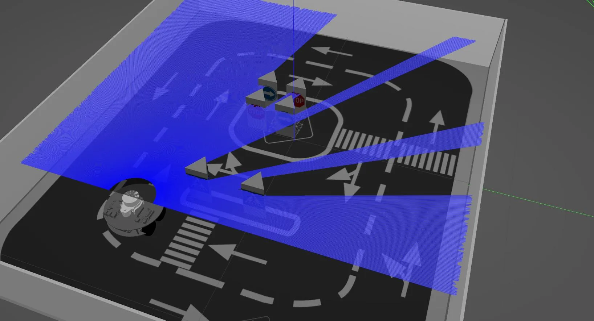
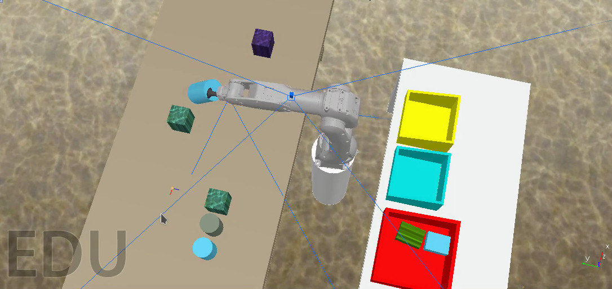

# 🚀 Gazebo Simulation – A Complete Guide  

Gazebo is a **powerful 3D robotics simulator** used for testing robots in realistic environments. It provides **physics simulation, sensor data generation, and robot visualization**, making it an essential tool for roboticists working with ROS 2.  

---

## 📌 Table of Contents  

1. [Introduction to Gazebo](#introduction-to-gazebo)  
2. [Installing Gazebo](#installing-gazebo)  
3. [Running Gazebo](#running-gazebo)  
4. [Understanding SDF (Simulation Description Format)](#understanding-sdf-simulation-description-format)  
5. [Integrating Gazebo with ROS 2](#integrating-gazebo-with-ros-2)  
6. [Spawning a Robot in Gazebo](#spawning-a-robot-in-gazebo)  
7. [Simulating Sensors in Gazebo](#simulating-sensors-in-gazebo)  
8. [Controlling Robots in Gazebo](#controlling-robots-in-gazebo)  
9. [Using Plugins in Gazebo](#using-plugins-in-gazebo)  
10. [Gazebo vs Ignition Gazebo](#gazebo-vs-ignition-gazebo)  

---





## 1️⃣ Introduction to Gazebo  

Gazebo is an **open-source robotics simulator** that provides:  

✔️ **Physics simulation** (gravity, friction, collisions)  
✔️ **3D visualization** for debugging robot models  
✔️ **Sensor simulation** (cameras, LiDAR, IMUs, GPS)  
✔️ **Multi-robot simulation** in complex environments  
✔️ **Integration with ROS 2** for robot control  

Gazebo is used in research, industry, and academia for **developing, testing, and validating robotic algorithms** before deploying them in real-world scenarios.  

---

## 2️⃣ Installing Gazebo  

For **ROS 2 users**, install **Ignition Gazebo (Fortress or later)** as it's officially supported.  

### 🔹 Installing Gazebo on Ubuntu  

```bash
sudo apt update
sudo apt install gazebo
```

To install **Ignition Gazebo (Fortress or later)**:

```
sudo apt install ros-humble-ros-ign

```

Verify the installation:

```
ign gazebo -v 4 -r visualize_lidar.sdf
```

------

## 3️⃣ Running Gazebo

To launch Gazebo standalone:

```
ign gazebo -v 4 -r visualize_lidar.sdf
```

To launch Ignition Gazebo:

```
ign gazebo -v 4
```

------

## 4️⃣ Understanding SDF (Simulation Description Format)

Gazebo uses **SDF (Simulation Description Format)**, an XML format defining **robots, environments, physics, and sensors** in the simulation.

### 🔹 Basic SDF Structure

```
<sdf version="1.6">
  <world name="default">
    <model name="box">
      <static>true</static>
      <link name="link">
        <visual name="visual">
          <geometry>
            <box>
              <size>1 1 1</size>
            </box>
          </geometry>
        </visual>
      </link>
    </model>
  </world>
</sdf>
```

This defines a **static box model** inside a Gazebo world.

------

## 5️⃣ Integrating Gazebo with ROS 2

Gazebo is integrated with **ROS 2** using the `gazebo_ros` package.

### 🔹 Launching Gazebo with ROS 2

```
ros2 launch ros_ign_gazebo ign_gazebo.launch.py
```

### 🔹 ROS 2 and Gazebo Topics

Gazebo publishes **sensor data and robot states** on ROS 2 topics. List all topics using:

```
ros2 topic list
```

Subscribe to Gazebo's `/clock` topic:

```
ros2 topic echo /clock
```

------

## 6️⃣ Spawning a Robot in Gazebo

To spawn a robot, you need a **URDF file** and launch it in Gazebo.

### 🔹 Spawn a URDF Robot

```
ros2 run ign_ros_gazebo create -file <yourFileName>
```

------

## 7️⃣ Simulating Sensors in Gazebo

Gazebo can simulate **LiDAR, cameras, IMUs, GPS, and depth sensors**.

### 🔹 Adding a LiDAR Sensor in SDF

```
<sensor name="lidar_sensor" type="ray">
  <update_rate>30</update_rate>
  <ray>
    <scan>
      <horizontal>
        <samples>720</samples>
        <resolution>1.0</resolution>
        <min_angle>-1.57</min_angle>
        <max_angle>1.57</max_angle>
      </horizontal>
    </scan>
  </ray>
</sensor>
```

This defines a **LiDAR sensor with 720 horizontal samples**.

------

## 8️⃣ Controlling Robots in Gazebo

ROS 2 nodes can **control** robots inside Gazebo by publishing commands to the appropriate topics.

### 🔹 Controlling a Differential Drive Robot

```
ros2 topic pub /cmd_vel geometry_msgs/Twist '{linear: {x: 0.5}, angular: {z: 0.2}}'
```

Use `ros2_control` for advanced robot actuation.

------

## 9️⃣ Using Plugins in Gazebo

Gazebo supports **C++ and Python plugins** to extend functionality.

### 🔹 Example of a Gazebo Model Plugin

```

<plugin name="my_plugin" filename="libmy_plugin.so"/>
```

Plugins can **control robots, interact with sensors, or modify physics properties dynamically**.

## 🎯 Conclusion

✔️ **Gazebo** is a powerful simulator for robotics development.
✔️ It allows **realistic physics and sensor simulations**.
✔️ It integrates seamlessly with **ROS 2** for robot control.
✔️ **Ignition Gazebo** is the future of robotics simulation.

🔜 **Next Steps:** Try spawning your own robot and adding sensors in Gazebo! 🚀

------

## 📚 Additional Resources

- Gazebo Official Docs
- ROS 2 + Gazebo Integration
- [SDF Format Documentation](http://sdformat.org/)
- [Ignition Gazebo Overview](https://ignitionrobotics.org/)