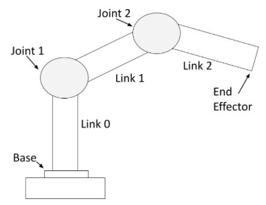
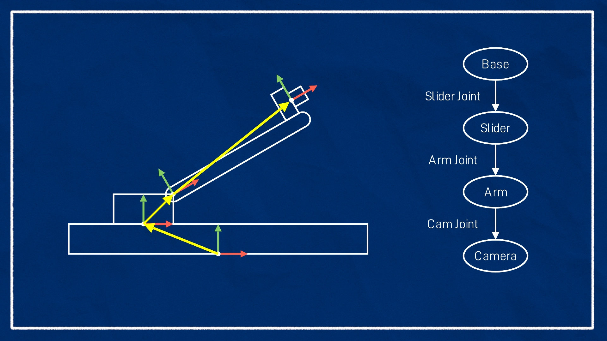
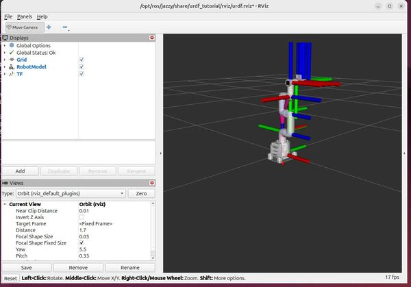

# 📖 URDF Tutorials – From Basics to Advanced  

Welcome to the **URDF (Unified Robot Description Format) tutorial series!** This guide will help you understand how to describe robot models in ROS 2 using URDF. By the end of this tutorial, you'll be able to create your own robot models and simulate them in Gazebo.  

---

## 📌 Table of Contents  

1. [Introduction to URDF](#introduction-to-urdf)  
2. [Basic Structure of a URDF File](#basic-structure-of-a-urdf-file)  
3. [Defining Links and Joints](#defining-links-and-joints)  
4. [Adding Visuals to the Robot](#adding-visuals-to-the-robot)  
5. [Adding Collision and Inertia Properties](#adding-collision-and-inertia-properties)  
6. [Defining Transmission for Actuation](#defining-transmission-for-actuation)  
7. [Using Xacro to Simplify URDF](#using-xacro-to-simplify-urdf)  
8. [Launching URDF in ROS 2](#launching-urdf-in-ros-2)  

---

## 1️⃣ Introduction to URDF  

URDF (Unified Robot Description Format) is an **XML-based format** used in ROS to define the **kinematic structure, visual appearance, and physical properties** of a robot. It allows ROS to simulate and visualize robots in tools like **Gazebo** and **RViz**.  

🔹 URDF helps define:  
✔️ Links (robot parts)  
✔️ Joints (connections between links)  
✔️ Physical properties (mass, inertia, collision)  

📌 **Example:** A simple two-link robot arm  

```xml
<robot name="simple_robot"> 
<link name="base_link"/> 
<joint name="joint1" type="revolute"> 
	<parent link="base_link"/> 
	<child link="link1"/> 
</joint>
<link name="link1"/>
</robot>
```

## 2️⃣ Basic Structure of a URDF File

A URDF file follows this structure:

```xml
<robot name="robot_name">
    <link>...</link>
    <joint>...</joint>
</robot>
```

📌 **Key elements of a URDF file:**
✔️ `<robot>` – The root element, defines the robot
✔️ `<link>` – Represents a single part of the robot
✔️ `<joint>` – Connects two links and defines their movement

------



## 3️⃣ Defining Links and Joints

### 🔹 Defining a Link

A link represents a **physical part** of the robot. Each link can have:
✔️ A visual model (what it looks like)
✔️ A collision model (for physics simulation)
✔️ Inertia properties (for realistic motion)

```xml
<link name="base_link">
    <visual>
        <geometry>
            <box size="0.5 0.5 0.5"/>
        </geometry>
        <material name="blue"/>
    </visual>
</link>
```



### 🔹 Defining a Joint

Joints define how links are connected and how they can move. Types of joints:
✔️ **Fixed** – No movement
✔️ **Revolute** – Rotational motion
✔️ **Prismatic** – Sliding motion

Example of a revolute joint:

```
<joint name="joint1" type="revolute">
    <parent link="base_link"/>
    <child link="link1"/>
    <axis xyz="0 0 1"/>
    <limit lower="-1.57" upper="1.57" effort="10.0" velocity="1.0"/>
</joint>

```


## 4️⃣ Adding Visuals to the Robot

To make the robot visually realistic, we can add **shapes and materials**:

```
<visual>
    <geometry>
        <cylinder radius="0.1" length="0.5"/>
    </geometry>
    <material name="red">
        <color rgba="1 0 0 1"/>
    </material>
</visual>
```



## 5️⃣ Adding Collision and Inertia Properties

### 🔹 Defining Collision

The collision model is **simplified** to reduce computational load in physics simulation. Collision is added for Simulation to detect collisions

```
<collision>
    <geometry>
        <box size="0.4 0.4 0.2"/>
    </geometry>
</collision>
```

### 🔹 Defining Inertia

For physics simulation, we need to define **mass and inertia**:

```
<inertial>
    <mass value="2.0"/>
    <inertia ixx="0.1" ixy="0" ixz="0" iyy="0.1" iyz="0" izz="0.1"/>
</inertial>
```

## 🎯 Conclusion

✔️ You have learned **URDF fundamentals** and how to build a robot model.
✔️ You can now create **links, joints, visuals, and physics properties**.

🔜 **Next Steps:** Try modifying an existing URDF file and experiment with different joint types and materials! 🚀

## 📚 Additional Resources

- ## 📚 Additional Resources

  - [Official URDF Documentation](http://wiki.ros.org/urdf/Tutorials)
  - [ROS 2 URDF Tutorial](https://articulatedrobotics.xyz/tutorials/ready-for-ros/urdf/)
  - [Create and Visualize a Robotic Arm with URDF](https://automaticaddison.com/create-and-visualize-a-robotic-arm-with-urdf-ros-2-jazzy)

  